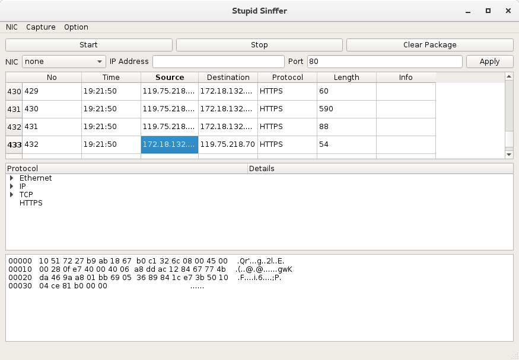

# lshark
Prepare to write a software of capturing packet using C.

## lSniffer
Run lSniffer as root.
```bash
sudo ./lSnifffer
```
## lSynflood

Run lSynflood as root. Be sure to keep in mind 'Do not be evil'.
```bash
sudo ./lSynflood <target ip> <target port> <pkt_then_sleep> <sleep time>
```

## lShark
Run lShark as root. A Stupid sniffer write in QT C++ and libpcap, Thanks for the wonderful demo of www.tcpdump.org/pcap.html.

```
cd lShark; sudo ./lShark
```
